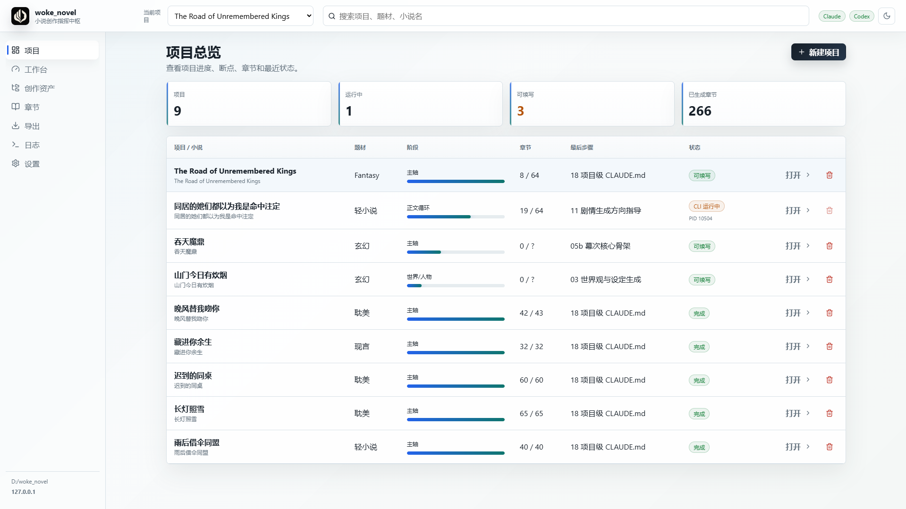
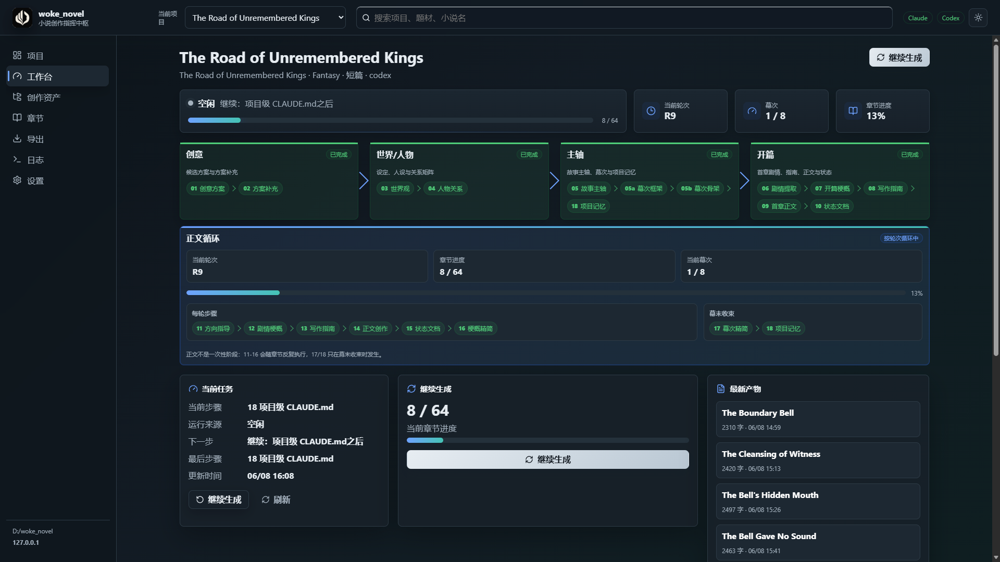
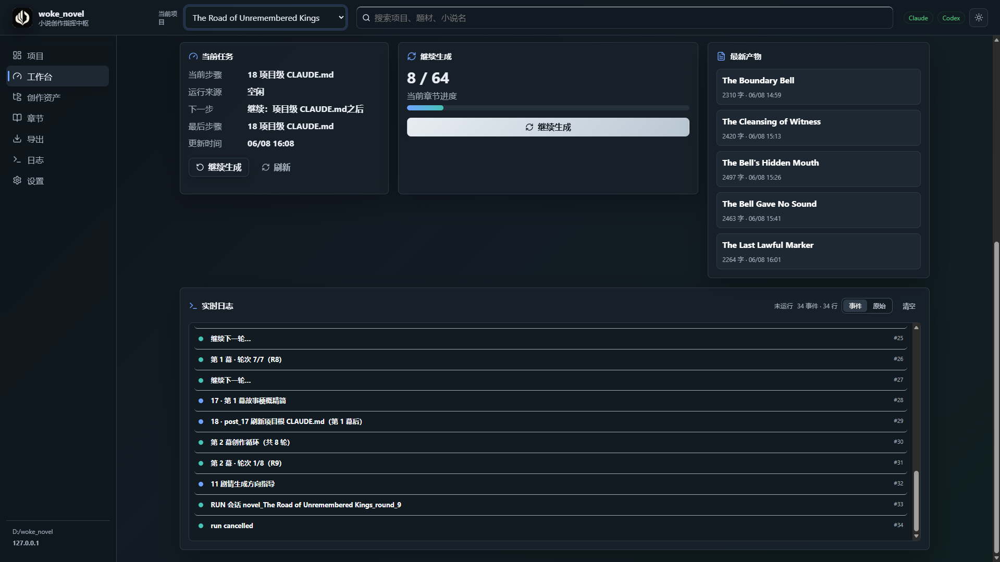
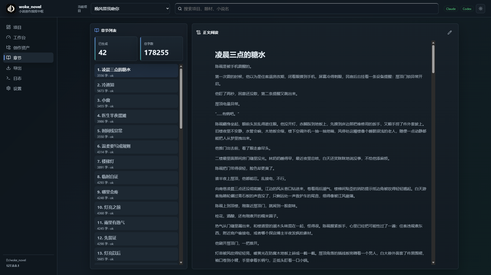

# woke_novel

[English](README.md) | [简体中文](README_zh-CN.md)

> ## Download the App
>
> **Latest packaged program: [Download woke_novel v2.0.1](https://github.com/keyboardgdy/woke_novel/releases/tag/v2.0.1)**
>
> Use this release page to download the ready-to-run application package. Source-code setup instructions remain below for developers.

Fully automated long-form novel generation workflow for Claude CLI or Codex CLI.

```
██╗    ██╗ ██████╗ ██╗  ██╗███████╗    ███╗   ██╗ ██████╗ ██╗   ██╗███████╗██╗
██║    ██║██╔═══██╗██║ ██╔╝██╔════╝    ████╗  ██║██╔═══██╗██║   ██║██╔════╝██║
██║ █╗ ██║██║   ██║█████╔╝ █████╗      ██╔██╗ ██║██║   ██║██║   ██║█████╗  ██║
██║███╗██║██║   ██║██╔═██╗ ██╔══╝      ██║╚██╗██║██║   ██║╚██╗ ██╔╝██╔══╝  ██║
╚███╔███╔╝╚██████╔╝██║  ██╗███████╗    ██║ ╚████║╚██████╔╝ ╚████╔╝ ███████╗███████╗
╚══╝╚══╝  ╚═════╝ ╚═╝  ╚═╝╚══════╝    ╚═╝  ╚═══╝ ╚═════╝   ╚═══╝  ╚══════╝╚══════╝
```

**Turn Claude / Codex into Your "Automated Chinese Web Novel Generator"**

*Pipeline · Multi-Act · Resume from Breakpoint · Strict Template-Driven*

`woke_novel` turns an external model CLI into a structured Chinese web-novel writing pipeline. The tool does not write prose by itself. Instead, it feeds the hard-constrained Markdown templates in `steps/` to Claude or Codex, asks the model to create each artifact, and writes the outputs into `projects/<novel_name>/`.

The workflow is designed for resumable, template-driven generation of a roughly 30-chapter Chinese web novel, from idea selection through worldbuilding, characters, story arc, chapter drafts, state tracking, and act summaries.

## Screenshots

<p align="center">
  
  
</p>
<p align="center">
  
  
</p>


## Features

- **Claude CLI and Codex CLI support**: choose either backend from the interactive menu or pass `--provider claude/codex` on the command line.
- **Template-driven pipeline**: 20 workflow templates plus shared writing rules under `steps/`.
- **Resumable execution**: progress is stored in `projects/<name>/.project_info.json`; `continue` resumes from the recorded cursor.
- **Multi-session orchestration**: workflow phases are split into separate CLI sessions to keep context boundaries manageable.
- **Dry-run mode**: use `--dry` to verify pipeline wiring without calling an external model CLI.
- **Project-local artifacts**: generated files are organized under `00_baseline`, `01_plots`, `02_guides`, `02_output`, `03_state`, and `04_characters`.

## Requirements

- Python 3.10+
- At least one supported model CLI installed and authenticated:
  - `claude` / `claude.cmd`
  - `codex` / `codex.cmd`
- Git, optional but recommended

Install Python dependencies:

```bash
pip install -r requirements.txt
```

Current Python dependencies are:

- `colorama`
- `rich`

## Quick Start

Clone the repository:

```bash
git clone https://github.com/keyboardgdy/woke_novel.git
cd woke_novel
```

Verify your model CLI:

```bash
claude --version
codex --version
```

Start the interactive menu:

```bash
python menu.py
```

Platform launchers are also included:

```bash
menu.bat       # Windows
./menu.sh      # Linux / macOS
./menu.command # macOS
```

The first run asks you to choose a backend, then guides you through genre selection, project naming, optional user description, idea selection, and full workflow execution.

## Visual Console

The project also includes a local web console for managing projects, running/resuming workflows, reading chapters, editing chapter text, viewing logs, and exporting MD/TXT/EPUB.

Build the frontend once:

```bash
cd frontend
npm install
npm run build
cd ..
```

Start the console:

```bash
python -m app_server.main
```

Then open:

```text
http://127.0.0.1:8787
```

On Windows, `woke.bat` can start the backend quietly and open the browser:

```bat
woke
```

If you want `woke` to work from any terminal, add the repository root to your user `PATH`.

## Command Line Usage

```bash
python run_workflow.py <command> [args]
```

Available commands:

| Command | Purpose | Common arguments |
| --- | --- | --- |
| `init` | Create a project interactively | `--genre`, `--novel-size` |
| `loop` | Run the full workflow | `--project-name`, `--genre`, `--provider`, `--option-count`, `--dry` |
| `continue` | Resume from `.project_info.json` | `--project-name`, `--provider`, `--dry` |
| `single <step>` | Run one workflow step | `-p`, `-g`, `--provider`, `--max-retries`, `--dry` |
| `session <block> <steps>` | Run a group of steps in one session | `-p`, `-g`, `--provider`, `--dry` |

Examples:

```bash
# Dry-run a single step after editing its template
python run_workflow.py single 11 -p my_novel -g fantasy --dry

# Run one step for real
python run_workflow.py single 11 -p my_novel -g fantasy

# Use Codex CLI as the backend
python run_workflow.py single 11 -p my_novel -g fantasy --provider codex

# Run the full workflow
python run_workflow.py loop --project-name my_novel --genre fantasy --option-count 3

# Continue after interruption
python run_workflow.py continue --project-name my_novel
```

## Backend Behavior

Each workflow step sends a resolved prompt to the selected external CLI process and expects the model to write artifacts into the project directory.

Current backend invocation behavior:

| Backend | Invocation mode |
| --- | --- |
| Claude CLI | Uses `--permission-mode bypassPermissions` |
| Codex CLI | Uses `--dangerously-bypass-approvals-and-sandbox` |

Use this project only inside a local workspace you trust. If you want a more conservative Codex setup, adjust the Codex arguments in `workflow_runner.py` to use a workspace sandbox policy that fits your environment.

## Workflow Overview

The full workflow is organized into these major phases:

| Phase | Steps | Main outputs |
| --- | --- | --- |
| Idea generation | `01` x N, `02` | Creative options, selected title, reference works |
| World and characters | `03`, `04` | Worldbuilding document, character JSON files, relationship matrix |
| Main arc | `05`, `05a`, `05b`, `18` | Story arc, act framework, act skeletons, project-level context |
| Opening | `06` to `10` | Opening plot, guide, prose draft, state document |
| Chapter loop | `11` to `16` | Plot direction, synopsis, writing guide, prose, state, compact summary |
| Act ending | `17`, `18` | Act summary and refreshed project context |

The runner extracts act counts and chapter counts from generated framework files, then loops through the remaining chapters accordingly. For the first act, the opening chapter is created before the normal chapter loop.

## Project Layout

```text
woke_novel/
├── cli.py
├── menu.py
├── run_workflow.py
├── ui.py
├── workflow_runner.py
├── path_resolver.py
├── project_info.py
├── project_structure.py
├── steps/
├── docs/
├── logs/
└── projects/
    └── <novel_name>/
        ├── .project_info.json
        ├── CLAUDE.md
        ├── 00_baseline/
        ├── 01_plots/
        ├── 02_guides/
        ├── 02_output/
        ├── 03_state/
        └── 04_characters/
```

Main modules:

| File | Responsibility |
| --- | --- |
| `menu.py` | Interactive menu entry point |
| `run_workflow.py` | Command-line workflow orchestration |
| `workflow_runner.py` | Step execution, retries, provider calls, session handling |
| `path_resolver.py` | Template path resolution and variable substitution |
| `project_info.py` | `.project_info.json` persistence and resume metadata |
| `project_structure.py` | Standard project directory creation |
| `steps/*.md` | Hard-constrained workflow prompts |

## Template Variables

`PathResolver.resolve()` replaces variables used in the Markdown templates. Common variables include:

| Category | Variables |
| --- | --- |
| Directories | `{project}`, `{baseline}`, `{plots}`, `{guides}`, `{output}`, `{state}`, `{chars}`, `{steps}` |
| Files | `{world}`, `{skeleton}`, `{axis}`, `{macro}`, `{constitution}`, `{evolution}` |
| Context | `{genre}`, `{project_name}`, `{round}`, `{round-1}`, `{option_index}`, `{user_description}`, `{ref_works}`, `{act_num}`, `{act_skeleton}`, `{prev_act_skeleton}` |

Avoid hard-coding absolute paths in templates. When changing artifact paths, update both the template and the resolver mapping.

## Resume Metadata

Progress is stored in `projects/<name>/.project_info.json`. A typical file contains:

```json
{
  "novel_name": "<final title>",
  "genre": "fantasy",
  "last_step": "14",
  "current_round": 7,
  "selected_option": 2,
  "ref_works": ["Reference A", "Reference B"],
  "act_count": 3,
  "chapter_counts": [12, 10, 8],
  "total_chapters": 30
}
```

Use `continue` after `Ctrl+C`, a failed CLI call, or a machine restart.

## Development Notes

- Use `--dry` before running expensive model calls.
- After editing a step template, validate it with `single <step> --dry`.
- If you add a workflow step, update the step maps in `workflow_runner.py` and the orchestration logic in `run_workflow.py`.
- The repository-level `CLAUDE.md` describes this tool. The generated `projects/<name>/CLAUDE.md` is an output artifact for future continuation and should not be confused with the repository guide.

## License

MIT. See `LICENSE`.
