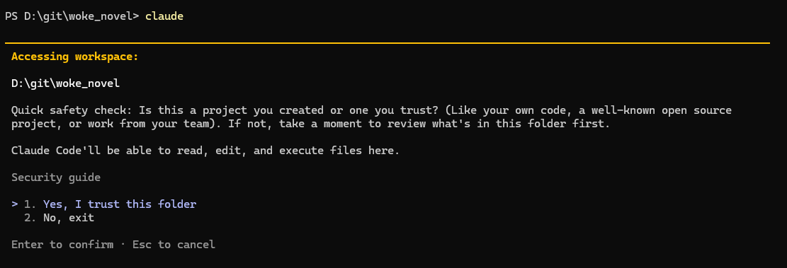
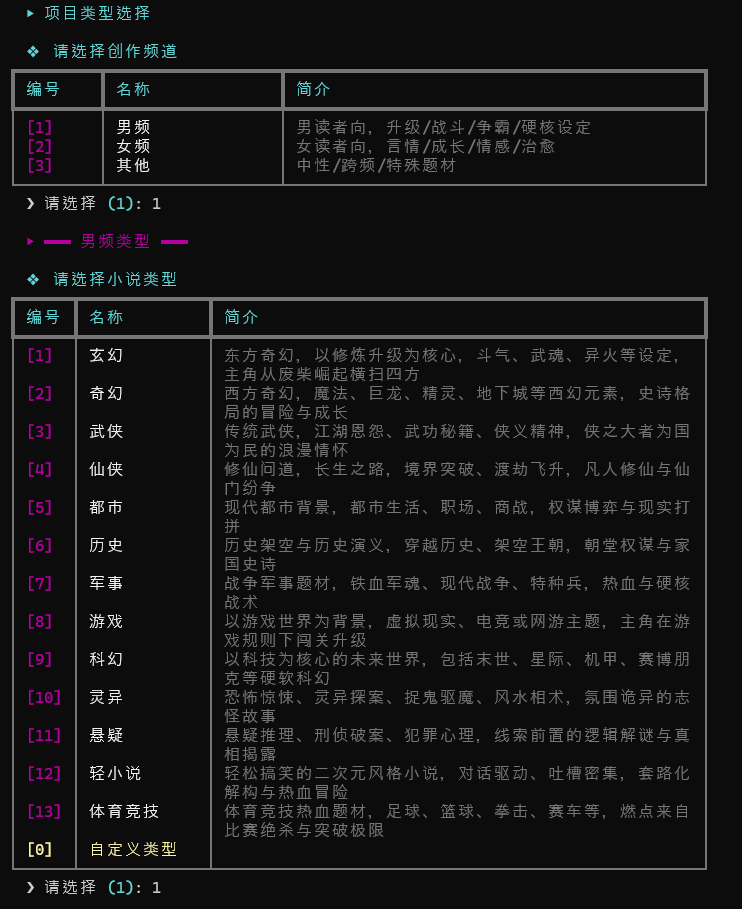

# woke_novel
全自动小说生成工具，**让 Claude / Codex 成为你的「中文网文自动生成工具」** *流水线 · 多幕 · 断点续写 · 强约束模板驱动*;Fully Automated Novel Generation Tool, Making Claude/Codex Your "Chinese Web Novel Auto-Generator";

<div align="center">

<br/>

```
██╗    ██╗ ██████╗ ██╗  ██╗███████╗    ███╗   ██╗ ██████╗ ██╗   ██╗███████╗██╗
██║    ██║██╔═══██╗██║ ██╔╝██╔════╝    ████╗  ██║██╔═══██╗██║   ██║██╔════╝██║
██║ █╗ ██║██║   ██║█████╔╝ █████╗      ██╔██╗ ██║██║   ██║██║   ██║█████╗  ██║
██║███╗██║██║   ██║██╔═██╗ ██╔══╝      ██║╚██╗██║██║   ██║╚██╗ ██╔╝██╔══╝  ██║
     ╚███╔███╔╝╚██████╔╝██║  ██╗███████╗    ██║ ╚████║╚██████╔╝ ╚████╔╝ ███████╗███████╗
      ╚══╝╚══╝  ╚═════╝ ╚═╝  ╚═╝╚══════╝    ╚═╝  ╚═══╝ ╚═════╝   ╚═══╝  ╚══════╝╚══════╝
```

**让 Claude / Codex 成为你的「中文网文自动生成工具」**
*流水线 · 多幕 · 断点续写 · 强约束模板驱动*

<br/>

[](#)
[](#)
[](#)
[](#)
[](#)

</div>

---

## **woke_novel**是什么

**woke_novel** 把 `claude` CLI 或 `codex` CLI 变成一条「中文网文联合创作流水线」。
工具本身不写一个字——它按顺序把 `steps/` 下的 20 份硬约束 Markdown 模板喂给外部 CLI 子进程，
让大模型把每一步产物（创意 → 世界观 → 人物 → 主轴 → 剧情 → 正文 → 状态）规规矩矩地落到
`projects/<小说名>/` 对应目录里，全程可断点续跑。

**适用场景**：想从零写一部 30 章、3 幕结构的中文长篇网文（玄幻/都市/仙侠/科幻/游戏/其他），
且希望每一步都遵循一套可复用的硬约束（创作宪法、故事演化原则、流程编排、六大创意技巧）。

---
不会配置？进群解决


## 快速开始

Star是GitHub上对开源项目最直接的鼓励。😊

```bash
git clone https://github.com/keyboardgdy/woke_novel.git
```
**前置**：Python 3.10+ · `claude` CLI 或 `codex` CLI 在 `PATH`（Windows 下 `.cmd` / `.bat` 也可） · Git（可选）

### 1. 安装模型 CLI

本工具支持两种后端，进入 `menu.py` 后会先让你选择：

- **Claude CLI**：使用 `claude` / `claude.cmd`
- **Codex CLI**：使用 `codex` / `codex.cmd`

至少安装并登录其中一种即可。Claude 可参考 [Claude Code 文档](https://code.claude.com/docs/en/setup)；Codex 请按 OpenAI Codex CLI 的安装方式配置，并确认命令在 PATH 中可用。

```bash
git clone https://github.com/keyboardgdy/woke_novel.git
cd woke_novel
claude --version                                  # 验证 Claude CLI
codex --version                                   # 验证 Codex CLI
```
### 2. 配置模型 API

[cc-switch](https://github.com/farion1231/cc-switch) 是一个便捷的工具，可以快速切换 Claude Code 的 API 配置。使用 Codex CLI 时，请确保 Codex 已完成登录或 API 配置。

```bash
cd woke_novel
claude                                 # 确保可以正常对话
codex                                  # 如果选择 Codex，也先确认可以正常对话
```
信任小说文件夹（不可跳过，否则导致没有写入权限）



### 3. 安装Python和配置环境

安装Python 3.10+
[Download Python | Python.org](https://www.python.org/downloads/)
```bash
pip install -r requirements.txt
```
### 4.**启动**：
```bash
一键启动：Window点击 menu.bat；Mac OS点击menu.command
# 或
python menu.py                              # 交互式菜单（推荐新手）
# 或
python3 menu.py
# 或
python run_workflow.py loop -p my_novel -g 玄幻 --option-count 3
```

第一次进入菜单会先选择 Claude CLI 或 Codex CLI，之后引导：选题材 → 输项目名 → 输用户描述（可选）→ 确认开篇 → 自动跑完全流程。

### 5. 可视化前端

可视化前端用于项目管理、工作流启动/续跑、章节阅读与编辑、日志查看，以及 MD/TXT/EPUB 导出。

首次使用先构建前端：

```bash
cd frontend
npm install
npm run build
cd ..
```

手动启动本地 Web 控制台：

```bash
python -m app_server.main
```

浏览器打开：

```text
http://127.0.0.1:8787
```

Windows 也可以使用项目根目录的 `woke.bat` 一键启动：它会静默启动后端并打开浏览器。

```bat
woke
```

如果希望在任意命令行直接输入 `woke`，把 `D:\woke_novel` 或你的项目根目录加入用户 `PATH`。

### 后端与自动批准

工作流会把每一步 prompt 投喂给外部 CLI 子进程，并要求模型直接把产物写入 `projects/<小说名>/`。为了避免非交互式流水线卡在权限确认界面，当前实现会自动跳过 CLI 审批：

| 后端         | 当前调用方式                                       | 说明                                   |
| ---------- | -------------------------------------------- | ------------------------------------ |
| Claude CLI | `--permission-mode bypassPermissions`        | 跳过 Claude 的权限确认，保持流水线无人值守执行          |
| Codex CLI  | `--dangerously-bypass-approvals-and-sandbox` | 跳过 Codex 审批并关闭 Codex 沙箱，适合已信任的本地项目环境 |

如果你希望 Codex 更保守运行，可以在 `workflow_runner.py` 里把 Codex 参数改为 `--ask-for-approval never --sandbox workspace-write`。这样仍不弹审批确认，但会保留工作区写入沙箱。

---
woke_novel技术交流群

加入我们

---
## 命令参考

```
python run_workflow.py <command> [args]
```

| 命令 | 用途 | 关键参数 |
| --- | --- | --- |
| `init` | 交互式建项目 | — |
| `loop` | 跑完整流水线 | `-p <name>` · `-g <genre>` · `--provider claude/codex` · `--option-count` (默认 3) · `--dry` |
| `continue` | 从 `.project_info.json` 的 `last_step` 续跑 | `-p <name>` · `--provider claude/codex` · `--dry` |
| `single <step>` | 跑单个步骤（改完模板后单步验证） | `-p` · `-g` · `--provider claude/codex` · `--max-retries` (默认 3) · `--dry` |
| `session <block> <s1,s2,...>` | 在**一个** CLI session 里顺序跑一组步骤 | `-p` · `-g` · `--provider claude/codex` · `--dry` |

**常用场景**

```bash
# 改完 step 11 模板先干跑
python run_workflow.py single 11 -p my_novel -g 玄幻 --dry
# 没问题再去掉 --dry 真跑
python run_workflow.py single 11 -p my_novel -g 玄幻

# 使用 Codex CLI 后端
python run_workflow.py single 11 -p my_novel -g 玄幻 --provider codex

# 中途 Ctrl+C 或断电后接上
python run_workflow.py continue -p my_novel

# 换题材复用项目：编辑 .project_info.json 改 genre → 删 00_baseline/ 里依赖旧题材的产物 → continue
```
---
新增题材选择功能 （日期6.4更新）

---
## 核心特性

- **流水线编排** — 20 步按 `创意 → 世界 → 主轴 → 开篇 → 循环创作 → 幕末` 一气呵成；
  按 `display_id` 切片到 6 个 CLI session，跨会话严格隔离，同一会话尽量续接上下文
- **断点续写** — 进度落在 `projects/<name>/.project_info.json`；`continue` 模式只续循环段，不重做已完成的世界观与主轴
- **强约束模板** — 4 份「宪法级」Markdown（创作宪法 / 故事演化原则 / 流程编排 / 六大创意技巧）在每步 prompt 头部注入
- **变量插值** — `{project}` / `{baseline}` / `{round}` / `{act_num}` / `{act_skeleton}` 等十余个变量由 `PathResolver.resolve()` 统一替换，模板里**绝无硬编码绝对路径**
- **多幕循环** — 自动从 `幕次框架.md` 抽幕数与每幕章节数；开篇消耗 1 章后第一幕跑 `act_chapters − 1` 轮，其余幕按完整章节数循环
- **干运行模式** — `--dry` 下完全不调外部 CLI，每步返回伪造产物并落占位文件，方便没装模型 CLI 的环境做联调

---

## 架构

```
  ┌────────────────┐   ┌────────────────┐   ┌────────────────┐
  │   入口层       │   │   交互层       │   │   编排层       │
  │ menu.py        │ ─►│ cli.py / ui.py │ ─►│ workflow_      │
  │ run_workflow.py│   │ (提示/配色)    │   │ runner.py      │
  └────────────────┘   └────────────────┘   └────┬───────────┘
                                                  │
                       ┌──────────┬───────────────┼───────────────┐
                       ▼          ▼               ▼               ▼
                  path_resolver  project_info   steps/*.md    CLI provider
                  (变量替换)     (断点 JSON)    (20 份模板)   (子进程 1800s)
```

**模块责任**

| 文件 | 职责 |
| --- | --- |
| `run_workflow.py` | 顶层 CLI：`init` / `loop` / `continue` / `single` / `session` |
| `menu.py` / `menu.bat` | 交互式菜单入口 |
| `cli.py` / `ui.py` | 询问题材/项目名/描述；所有可见输出 |
| `workflow_runner.py` | 步骤编排、`display_id` → UUID 映射、`run_step()` |
| `path_resolver.py` | 模板路径解析与变量替换 |
| `project_info.py` | `.project_info.json` 读写（断点依据） |
| `project_structure.py` | 首次构造项目时建 6 个子目录 |
| `steps/*.md` | 20 份硬约束模板 + 4 份宪法级文件 |

---

## 流水线

完整 `loop` 走完一次约 18 步，按 CLI session 切成 6 段：

```
  ┌──────────┐   ┌──────────┐   ┌──────────┐   ┌──────────┐
  │  创意    │   │ 世界/人物│   │   主轴   │   │   开篇   │
  │ 01×N→02  │   │  03→04   │   │ 05→05a   │   │ 06→07→08 │
  │          │   │          │   │ →05b→18  │   │  →09→10  │
  └────┬─────┘   └────┬─────┘   └────┬─────┘   └────┬─────┘
       ▼              ▼              ▼              ▼
  ┌─────────────────────────────────────┐  ┌──────────────┐
  │         创作循环 (SESSION 5)        │  │ 幕末 (S6)    │
  │  11→12→13→14→15→16   (× N 轮)      │  │   17 → 18    │
  │  第一幕 act_chapters−1, 余幕 act_N  │  │ 刷新 CLAUDE.md│
  └─────────────────────────────────────┘  └──────────────┘
```

| 会话 | 步骤 | display_id | 关键产物 |
| --- | --- | --- | --- |
| 1 创意 | 01×N → 02 | `_creative_option` | `00_baseline/创意方案_{n}.md` + 抽书名 + `rename_project` |
| 2 世界/人物 | 03 → 04 | `_world` | `世界观.md` + `04_characters/*.json` |
| 3 主轴 | 05 → 05a → 05b×act → 18 | `_arc` | `故事主轴.md` + `幕次框架.md` + `核心骨架_{n}.md` + `CLAUDE.md` |
| 4 开篇 | 06 → 07 → 08 → 09 → 10 | `_opening` (act=1) | `剧情v1.md` + `指南v1.md` + `正文v1.md` + `状态v1.md` |
| 5 创作循环 | 11→16 | `_round_<n>` | 每轮一份「剧情/指南/正文/状态/梗概」 |
| 6 幕末 | 17 → 18 | `_act_<n>` | 末轮 `状态vN.md` + 刷新 `projects/<name>/CLAUDE.md` |

---


## 模板系统

**变量全集**（`PathResolver.resolve()` 替换）

| 类别 | 变量 |
| --- | --- |
| 目录 | `{project}` `{baseline}` `{plots}` `{guides}` `{output}` `{state}` `{chars}` `{steps}` |
| 文件 | `{world}` `{skeleton}` / `{axis}` `{macro}` `{constitution}` `{evolution}` |
| 上下文 | `{genre}` `{project_name}` `{round}` `{round-1}` `{option_index}` `{user_description}` `{ref_works}` `{act_num}` `{act_skeleton}` `{prev_act_skeleton}` |

> **硬约束**：Claude 写入路径禁止任何修改。`run_step()` 会在 prompt 头部注入「路径规则」——
> 修改路径时把 `path_resolver` 的简写一起改，否则后续步骤会找不到文件。

**数字提取**

| 函数 | 来源 | 提取 |
| --- | --- | --- |
| `extract_act_count_from_macro_model` | `幕次框架.md` | `幕次总数：N幕`（中/阿数字都吃） |
| `extract_chapter_count_from_skeleton(act)` | `核心骨架_{n}.md` | `章节数：N章` |
| `extract_all_chapter_counts` | 所有 `核心骨架_{n}.md` | 每幕章节数 + 总章节数（写回 JSON） |
| `extract_ref_works_from_creative` | `创意方案_*.md` 的 `## 参考作品` | `《…》` 标题，顿号拼接 |

---

## 断点续写

进度落在 `projects/<name>/.project_info.json`：

```jsonc
{
  "novel_name": "<最终书名>",
  "genre": "玄幻",
  "last_step": "14",
  "current_round": 7,
  "selected_option": 2,
  "ref_works": ["《A》", "《B》"],
  "act_count": 3,
  "chapter_counts": [12, 10, 8],
  "total_chapters": 30
}
```

---

## 项目结构

```
woke_novel/
├── cli.py · menu.py · menu.bat · run_workflow.py · ui.py
├── workflow_runner.py · path_resolver.py · project_info.py · project_structure.py
├── steps/                   # 20 份 Markdown 模板（4 份宪法级 + 16 份步骤级）
├── docs/                    # AI 擅长题材 / archive/
├── projects/<小说名>/       # 产物
│   ├── .project_info.json   # 断点 + 元数据
│   ├── CLAUDE.md            # 步骤 18 刷新，供未来 Claude 续写时读
│   ├── 00_baseline/         # 创意 / 文风 / 世界观 / 主轴 / 幕次框架 / 核心骨架
│   ├── 01_plots/            # 剧情v{n}.md
│   ├── 02_guides/           # 写作指南v{n}.md
│   ├── 02_output/           # 正文v{n}.md
│   ├── 03_state/            # 状态v{n}.md + 故事总梗概.md
│   └── 04_characters/       # 人物档案.json + 关系矩阵.json
└── logs/<小说名>/           # 运行日志（与 projects/ 平级）
```

---

## 贡献
祝你项目大火！⭐ 需要其他帮助随时告诉我。

`steps/*.md` 的措辞、约束、变量都欢迎推敲；改完用 `python run_workflow.py single <step> -p <name> -g <g> --dry` 验证。
加步骤需同步改 `STEP_FILES` / `STEP_NAMES` / `STEP_FILE_MAP` 三处。PR 标题前缀 `feat:` / `fix:` / `docs:` / `refactor:` / `chore:`。

> 仓库根 `CLAUDE.md` 是工具自身说明；`projects/<name>/CLAUDE.md` 是步骤 18 生成的工作流产物——两份**不要混淆**。

如果好用请给我一个支持，我会持续优化更新
<div align="center">


</div>

---
## 求职意向

- 🎯 **目标岗位**：Python或者C#全栈软件工程师；Agent工程师
- 🛠 **技术栈**：Python, WPF, Docker, Claude
- 📍 **地点偏好**：北京/上海/深圳/南京/合肥
- 📫 **联系方式**：
  - 邮箱：gdy153355@outlook.com
  - 微信：GDY153355
  - bilibili：[哔哩哔哩](https://space.bilibili.com/1438443705)

> 当前已离职，可立即到岗。

---

## 致谢

- **Anthropic Claude** — 没有 `claude` CLI 就没有这个工作流
- **cc-switch**
- **网文创作社区** — 「创作宪法」「故事演化原则」是几代作者心血的提炼
- 留下早期草稿的 `docs/archive/` 作者们 · 看到这里的你

<div align="center">

<sub>愿你和你的 AI 联合创作愉快。</sub>

</div>
